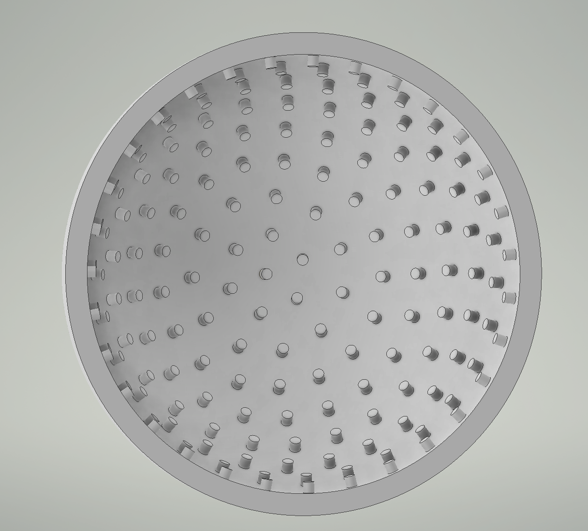
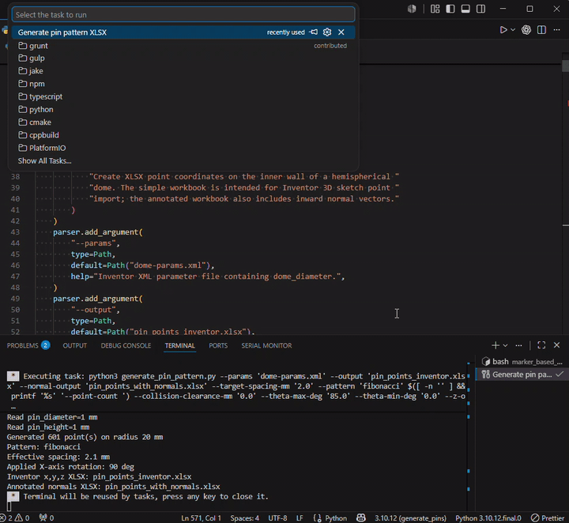

# Marker-Based Tactile Sensor Dome Pin Pattern

This workflow creates point coordinates for placing inward-facing pins on the
inside wall of a hemispherical dome in Autodesk Inventor.

The main idea is:

1. Build the dome and one seed pin in Inventor from shared parameters.
2. Export the Inventor parameters to XML.
3. Run `generate_pin_pattern.py` to create an Excel workbook of 3D points.
4. Import those points into a 3D sketch.
5. Use Inventor's Sketch Driven Pattern to duplicate the pin onto the imported
   points.

## Result



## Files

- `dome.ipt`: Inventor dome part.
- `dome-params.xml`: exported Inventor parameter file.
- `generate_pin_pattern.py`: point generator.
- `pin_points_inventor.xlsx`: generated `x, y, z` point workbook for Inventor.
- `pin_points_with_normals.xlsx`: generated diagnostic workbook with point
  metadata and inward normal vectors.
- `.vscode/tasks.json`: VS Code task for running the generator with prompts.
- `assets/image.png`: screenshot of the patterned dome result.
- `assets/create_points.gif`: animation of importing/generated points.
- `assets/create_pins.gif`: animation of creating the Sketch Driven Pattern.

## Inventor Workflow

1. Create the dome in Autodesk Inventor.

   The dome should be parameter-driven. The generator expects the exported
   parameter file to contain at least:

   - `dome_diameter`
   - `pin_diameter`
   - `pin_height`

2. Create one pin at the bottom center of the inner dome.

   This is the seed feature/body used by the Sketch Driven Pattern. The pin
   should be aligned correctly at the bottom center, pointing inward toward the
   dome center.

3. Export the Inventor parameters.

   Save the exported parameter XML as:

   ```text
   dome-params.xml
   ```

   Place it in the same folder as `generate_pin_pattern.py`.

4. Run the Python generator.

   Default command:

   ```bash
   python3 generate_pin_pattern.py
   ```

   This creates:

   ```text
   pin_points_inventor.xlsx
   pin_points_with_normals.xlsx
   ```

5. In Inventor, create a 3D sketch.

6. In the 3D sketch, go to the `Insert` tab and choose `Points`.

7. Import/select `pin_points_inventor.xlsx`.

   This workbook contains only the `x`, `y`, and `z` coordinate columns needed
   by Inventor.

   

8. Finish/close the 3D sketch.

9. Create the pin pattern.

   In Inventor, use:

   ```text
   Pattern tab -> Sketch Driven
   ```

   Then set:

   - `Placement / Sketch`: select the imported sketch points.
   - `Features`: select the single seed pin.
   - `Base Point`: select the bottom center point.
   - `Faces`: select the inner spherical dome wall.

   The generator includes the bottom center point by default so it is available
   for this `Base Point` selection. Use `--exclude-center` only if a later
   workflow does not need that point in the imported sketch.

   

10. Confirm the pattern.

    The duplicated pins should be placed on the inner spherical surface and
    should face toward the dome center if Inventor resolves the face orientation
    correctly.

## Running From VS Code

There is a VS Code task called:

```text
Generate pin pattern XLSX
```

Run it with:

```text
Ctrl+Shift+P -> Tasks: Run Task -> Generate pin pattern XLSX
```

or:

```text
Ctrl+Shift+B
```

The task prompts for all relevant script arguments.

## Generator Options

Default settings:

```bash
python3 generate_pin_pattern.py
```

Useful examples:

```bash
# Use the default ring pattern
python3 generate_pin_pattern.py --pattern rings

# Use the Fibonacci / sunflower pattern
python3 generate_pin_pattern.py --pattern fibonacci

# Use Fibonacci with a fixed number of points
python3 generate_pin_pattern.py --pattern fibonacci --point-count 170

# Increase approximate pin spacing
python3 generate_pin_pattern.py --target-spacing-mm 5.0

# Stop before the rim
python3 generate_pin_pattern.py --theta-max-deg 80

# Exclude the center point
python3 generate_pin_pattern.py --exclude-center

# Add extra clearance between pin cylinders
python3 generate_pin_pattern.py --collision-clearance-mm 0.2
```

Important options:

- `--pattern rings`: latitude-ring style distribution.
- `--pattern fibonacci`: golden-angle sunflower distribution on the spherical
  cap.
- `--point-count`: fixed point count for Fibonacci mode.
- `--target-spacing-mm`: approximate spacing between neighboring pins.
- `--theta-max-deg`: maximum angle from the bottom pole. `90` reaches the cut
  rim; lower values leave a margin.
- `--exclude-center`: omit the bottom center point from the generated workbook.
- `--rotate-x-deg`: rotates output coordinates around the X axis. The default
  is `90`, matching the current Inventor orientation.
- `--precision`: decimal places in the workbook. The default is `8`.

## Collision Checks

The generator reads `pin_diameter` and `pin_height` from `dome-params.xml`.

It assumes each pin is a straight inward-facing cylinder and checks whether the
generated pin axes would collide. If the requested spacing is too small, the
script prints a warning and falls back automatically:

- For spacing-driven generation, it increases the effective spacing.
- For fixed-count Fibonacci generation, it reduces the point count.

The optional clearance setting is added to the pin diameter during collision
checks:

```bash
python3 generate_pin_pattern.py --collision-clearance-mm 0.2
```

## Known Limitation

The Excel workbook only gives Inventor point positions. It does not pass
orientation vectors into the 3D sketch.

The intended Inventor workflow is to let Sketch Driven Pattern use the inner
spherical face as the orientation reference. If some pins point in inconsistent
directions, the generated points are probably still correct; Inventor may be
choosing inconsistent local surface frames for the pattern.

If that happens, the fallback approach is an iLogic/API workflow that uses the
normal vectors from `pin_points_with_normals.xlsx` to place each pin explicitly
along its inward axis.

## Optional GIF

A short video can be converted to a GIF and embedded in this README. Put the
video in `assets/`, for example:

```text
assets/result.mp4
```

Then run:

```bash
ffmpeg -y -i assets/result.mp4 \
  -vf "fps=12,scale=900:-1:flags=lanczos,palettegen" \
  /tmp/result-palette.png

ffmpeg -y -i assets/result.mp4 -i /tmp/result-palette.png \
  -filter_complex "fps=12,scale=900:-1:flags=lanczos[x];[x][1:v]paletteuse=dither=bayer:bayer_scale=5" \
  assets/result.gif
```

Embed it with:

```markdown

```

GIF does not have a useful fixed maximum frame count for this workflow, but it
gets large quickly because every frame adds data. For README use, keep it short:
about 3-8 seconds, 10-15 fps, and around 900 px wide is usually a good balance.
